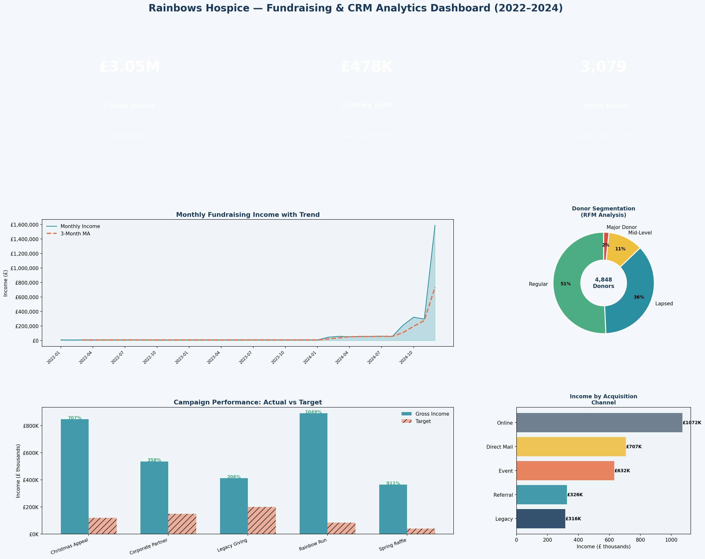

# 💷 CRM Fundraising & Donor Analytics — ThankQ-Style Data Pipeline

> A Python ETL pipeline and SQL-driven analytics system simulating the donor data management and fundraising reporting workflow of a charity CRM (modelled on ThankQ), including Gift Aid tracking, GDPR compliance flagging, and campaign performance dashboards.

---

## 📌 Project Overview

Charities like children's hospices rely on accurate CRM data to sustain fundraising income. This project simulates the full data lifecycle of a fundraising database: ingesting donor and donation records, cleaning and de-duplicating data, enforcing GDPR compliance checks, and producing campaign performance reports for the fundraising team.

**Key skills demonstrated:** Python ETL (extract, transform, load), SQL (de-duplication, RFM segmentation, Gift Aid calculation), Power BI-style dashboard, GDPR data governance, donor analytics.

---

## 📊 Dashboard Preview



---

## 🗂️ Repository Structure

```
project2_crm_fundraising/
├── analysis.py          # Python ETL pipeline + visualisation
├── sql_queries.sql      # SQL schema + 5 production queries
├── dashboard.png        # Output dashboard
└── README.md
```

---

## 🔑 Key Findings

| Metric | Result |
|--------|--------|
| Total gross income (2022–2024) | **£3.05M** |
| Gift Aid uplift recovered | **£478K** |
| Active donors | **3,431** (retained in last 12 months) |
| Lapsed donors flagged | **1,769** (GDPR suppression review) |
| Duplicate records identified | **426** — resolved via de-duplication pipeline |
| Top acquisition channel | **Online** (35% of income) |
| Highest-performing campaign | **Rainbow Run** |
| Major donors (RFM segment) | **81** donors contributing disproportionate income |

---

## 🛠️ Technical Approach

### Python ETL Pipeline (`analysis.py`)

**Extract:** Simulates ingestion of 5,200 donor records and 14,000 donation transactions from a ThankQ-style CRM export.

**Transform:**
- De-duplication by matching on channel, region, and first gift date
- Referential integrity check (orphaned donations)
- Negative amount validation
- GDPR suppression flagging (donors inactive 3+ years)
- RFM (Recency, Frequency, Monetary) segmentation — Major Donor / Mid-Level / Regular / Lapsed

**Load:** Cleaned data aggregated for dashboard visualisation and campaign reporting.

### SQL Queries (`sql_queries.sql`)

| Query | Purpose |
|-------|---------|
| 1. De-duplication | Window function to rank and flag duplicate donor records |
| 2. Donor Retention & Lapse | Days since last gift, donor lifecycle status |
| 3. Campaign Performance | Actual vs target + Gift Aid uplift + RAG status |
| 4. RFM Segmentation | Recency/Frequency/Monetary donor ranking for targeted outreach |
| 5. GDPR Compliance Check | Flags donors with missing consent flags for data governance review |

---

## 💻 How to Run

```bash
# Install dependencies
pip install pandas numpy matplotlib

# Run analysis
python analysis.py
```

---

## 🔐 Data Governance Notes

- All donor data in this project is **entirely synthetic** — generated for demonstration purposes only
- GDPR compliance checks mirror real charity sector requirements (UK GDPR, Fundraising Regulator guidance)
- Lapsed donor flagging supports lawful basis review and suppression workflows
- Gift Aid calculations follow HMRC standard (25p per £1 from basic-rate taxpayers)

---

## 👤 Author

**Nakul Gangan** | MSc Geographic Data Science, University of Liverpool  
[LinkedIn](https://linkedin.com/in/nakulgangan066207104) | nakulgangan@gmail.com
